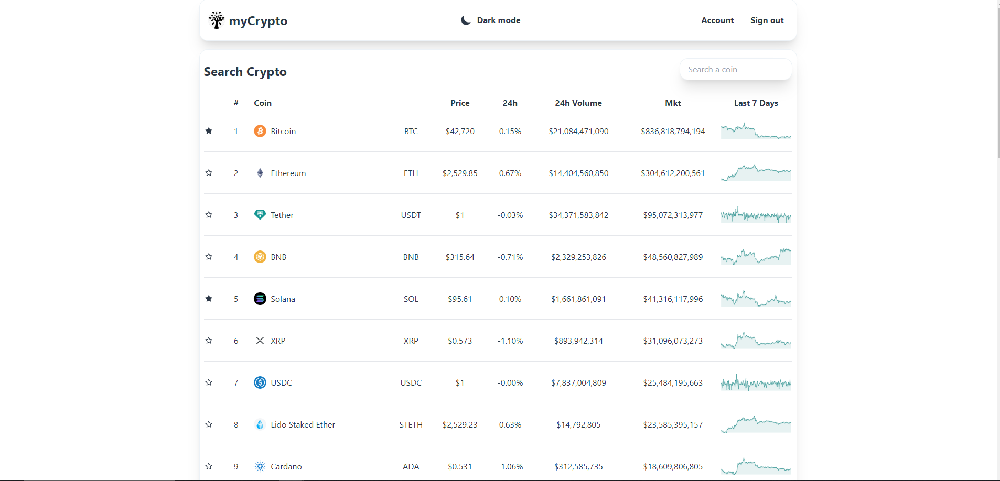
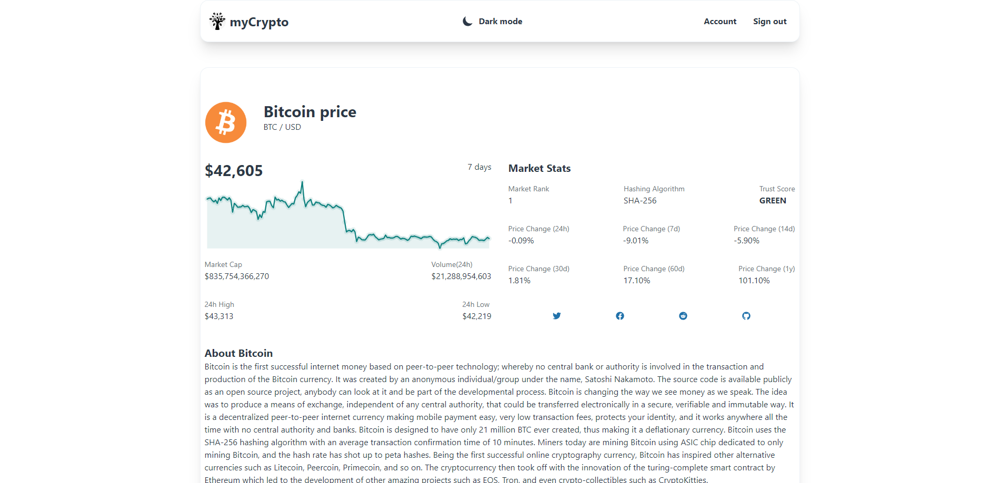
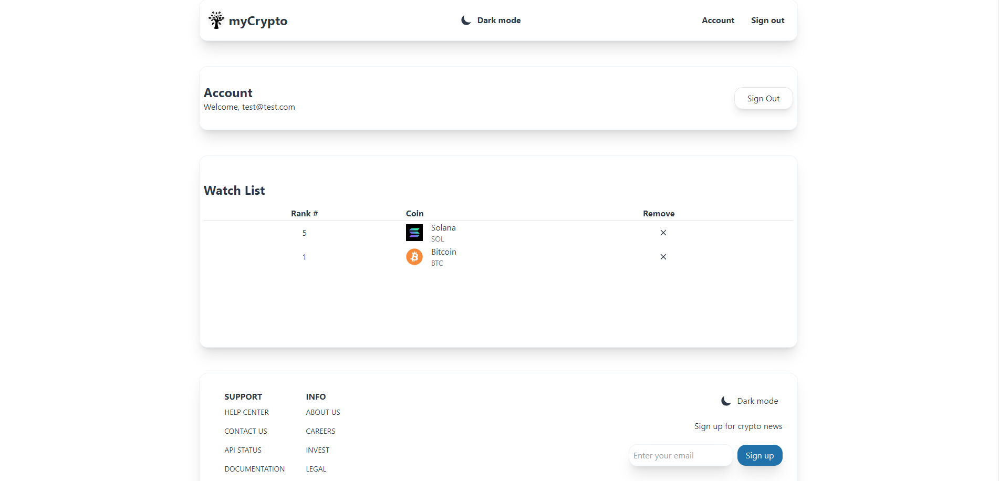

# myCrypto-portfolio

This is a fullstack web app which tracks the top 20 cryptocurrencies and other trending coins to give the user a good picture of the current landscape of cryptocurrencies. The user has the ability to view more information for each coin and to save them to a watch list to keep track of them.

The app has user validation and as such the user is able to sign up to the app and keep their own personal data to themselves with the backend being set up on firebase.

## Table of contents

- [Overview](#overview)
  - [Requirements](#requirements)
  - [Screenshots](#screenshots)
  - [Links](#links)
  - [Getting Started with Create React App](#getting-started-with-create-react-app)
- [My process](#my-process)
  - [Built with](#built-with)
  - [What I learned](#what-i-learned)
  - [Useful resources](#useful-resources)
- [Author](#author)

## Overview

### Requirements

- Display important and relavant API data for top cryptocurrencies on front page with another section for trending cryptocurrencies.
- when a coin is clicked on, a page for the coin should come up which has more in depth information about the coin and a description.
- User login with validation. User should be able to select to save coins from home page to watch list which will be displayed on the accounts page.
- Mobile friendly display.
- Ability to switch themes (light/dark)
- Sign in/ Sign out and account page should have appropriate functionality for when the user logs in and logs out.

### Screenshots





### Links

- Live Site URL: [@Firebase](https://mycrypto-28bfe.web.app/)
- Solution URL: [@GitHub](https://github.com/WAYD0S/crypto-portfolio-fullstack)

### Getting Started with Create React App

This project was bootstrapped with [Create React App](https://github.com/facebook/create-react-app).

## My process

Before dwelving intot the project I planned the routes for the project and how the links will be connected on paper based on the data that was available from the API.

The initial step was to create the home page which required a connection to the [CoinGecko API](https://www.coingecko.com/api/documentation). Once I was able to display the data producing the full page was significantly easier as it required relatively simple css.

The account page for myCrypto needed to show the saved list of coins from the home page. To set this up  

### Built with

- React.js components
- Tailwind CSS (grid and flexbox)
- React-router for web-app routing
- Firebase for backend framework

### What I learned

- One simple thing I changed in comparison to previous projects was the utilisation of ThemeContext.jsx to setup the dark/light theme. ThemeContext.jsx was the context provider where the UI theme was setup. getInitialTheme() was used to gather what the system lighting setting was so that the user automatically got either the light or dark theme according to their preferences.

```js
const getInitialTheme = () => {
  if (typeof window !== 'undefined' && window.localStorage) {
    const storedPrefs = window.localStorage.getItem('color-theme')
    if (typeof storedPrefs == 'string') {
      return storedPrefs
    }

    const userMedia = window.matchMedia('(prefers-color-scheme: dark)')
    if(userMedia.matches) {
      return 'dark'
    }
  }
  return 'light'
}
```

- React-router integration into the project made it much smoother and easier to use. Browswer router and its ability to make dynamic changes meant that components of the page didn't have to be reloaded everytime and such the webpage worked more seamlessly. It also made linking pages to each other easier with the `<Link>` tag.

### Useful resources

- [ReactJS](https://reactjs.org/tutorial/tutorial.html) - How to set up a local development environment on your computer
- [CoinGecko](https://www.coingecko.com/api/documentation) - API used for the project
- [Firebase](https://firebase.google.com/) - Utilised for the backend component of the project
- [React Router](https://www.w3schools.com/react/react_router.asp) - Page routing for React
- [Tailwind CSS](https://www.w3schools.com/react/react_router.asp) - CSS framework utilised for the project

## Author

- Website - [Rishabh Raturi](https://github.com/WAYD0S)
